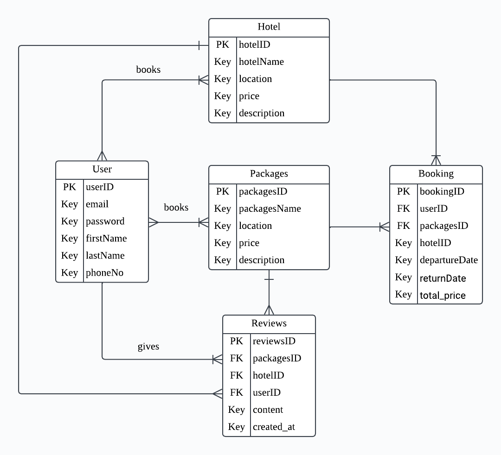
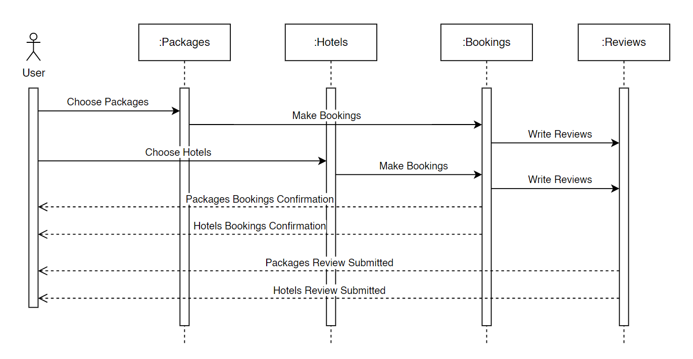
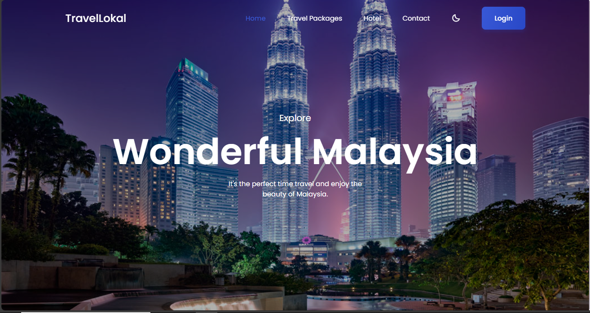
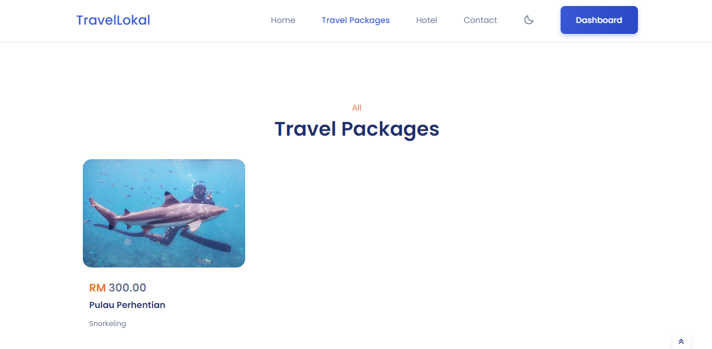
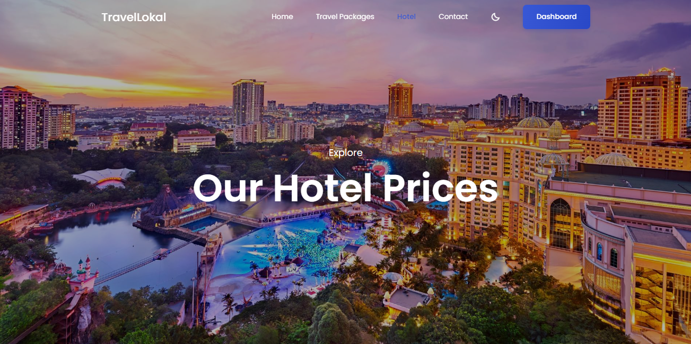

# TravelLokal

<h2 align="center">

  

INFO 3305 WEB APPLICATION DEVELOPMENT
  

SEMESTER 1 2023/2024
  

FINAL REPORT
  

SECTION 2
  

  
| Name        | Matric No           | 
| ------------- |:-------------:|
| MUHAMMAD ARIF FAISAL BIN ZAHARI      | 2117277 |
| MUHAMMAD ASYRAF BIN MOHD RADZI      | 2110473|
| MUHAMMAD BIN ABAS | 2113201     | 
| MUHAMMAD SYAHMI BIN MOHD AMIN | 2120907  | 
| MUHAMMAD SYAHMI BIN SALAM | 2115083 | 

</h2>

## Travel Booking System

TravelLokal: Where Every Destination Beckons

## Introduction

TravelLokal, an innovative web application, is set to revolutionize the exploration of Malaysia's hidden gems and local experiences. It's not just a planning tool for your next getaway but a portal to a world of wonders. The application offers personalized recommendations, user reviews and ratings, a travel itinerary planner, and connections with local guides for an authentic experience. Various promotions also come in TravelLokal, providing early bird discounts, seasonal deals, and a loyalty program to make the journey more exciting. These features and advertisements are designed to enhance your travel experience, making every click a new opportunity to create a wonderful memory in travel.

## Objectives

The main objective of TravelLokal is to build a user-centric platform that simplifies the entire travel experience inside a single location. The program promises to speed processes such as itinerary preparation, delivering tailored recommendations based on user preferences, and facilitating seamless bookings for hotels and transportation through intuitive design and user-friendly interfaces. The platform helps users to make wise decisions by centralizing local travel information, resulting in a more pleasurable and stress-free exploration of their selected destination.

## Features and functionalities

**Sign Up/Log In/ Forgot Password**
*	**Create New User:** Allow users to create their new c profiles to use TravelLokal Website
*	**Social Media or Email Integration:** Enable users to sign up or log in using their social media or email accounts, making the process more convenient and potentially increasing user engagement.
*	**Password Recovery:** Provide a mechanism for users to recover their passwords in case they forget them, such as through email or security questions.

**Account Page**
*	**User Profiles:** Allow users to manage their profile, where they can change their account settings information, view their booking history, view upcoming bookings and can make payments.

**Destination and Hotel Booking Page**
*	**Search and Filters:** Provide a search interface with filters for users to find specific travel options based on their preferences.
*	**Booking Process:** Guide users through a seamless booking process, including selecting places and dates, adding to cart, and making payments.
*	**Ratings and Reviews:** Provide a section where users can view and manage their ratings and reviews for past experiences.
*	**Payment Methods:** Allow users to add, edit, or remove their payment methods, such as credit cards or digital wallets.

## ERD diagram with relationship

User books Packages or Hotel: 
* Many-to-many relationship
* A user can book multiple packages or hotels, and a package or hotel can be booked by multiple users.

User gives Review: 
* One-to-Many relationship.
* A user can gives many reviews, but a review can only be given by a user.

Review is about Packages or Hotel: 
* One-to-many relationship.
* A review can be about one package or hotel, but a package or hotel can have multiple reviews.

## Sequence diagram for interaction representation

## Final System

**Home Page**

**Travel Package Page**

In this page it will display all available package that we offer. It will also show the price of the package, the destination, and short description about the package.

**Hotel Page**

In the hotel page, we display all hotel options that are available for the customers. The price will be displayed along with the hotel name and also description about the hotel. 

## Challenge/difficulties to develop the web application

1. Managing project complexity: Large and complex web applications such as Traveloka is difficult to manage, even with Laravel's features.
2. Review event: Due to its dependence on completed bookings, integrating it presents technical complexities that require further development.
3. Requires more skills and understanding:Some parts of the coding requires us to learn new things from the internet. Although, it is a beneficial challenges to us.

